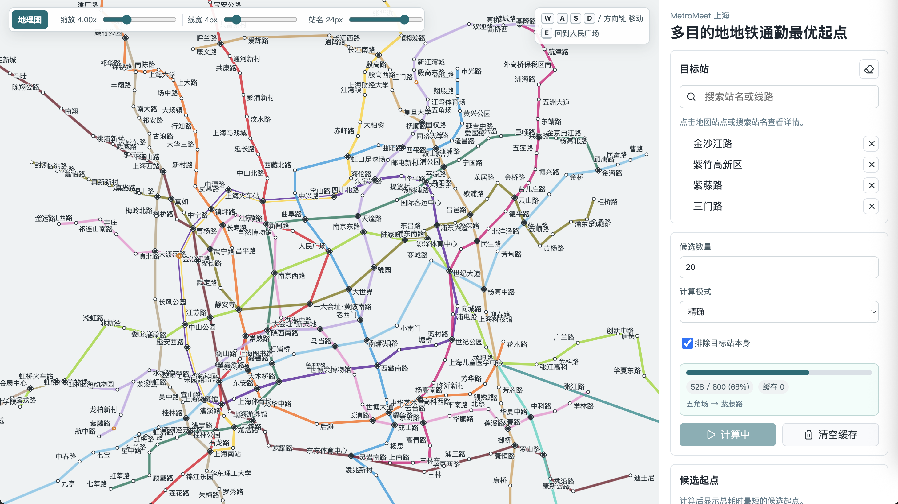
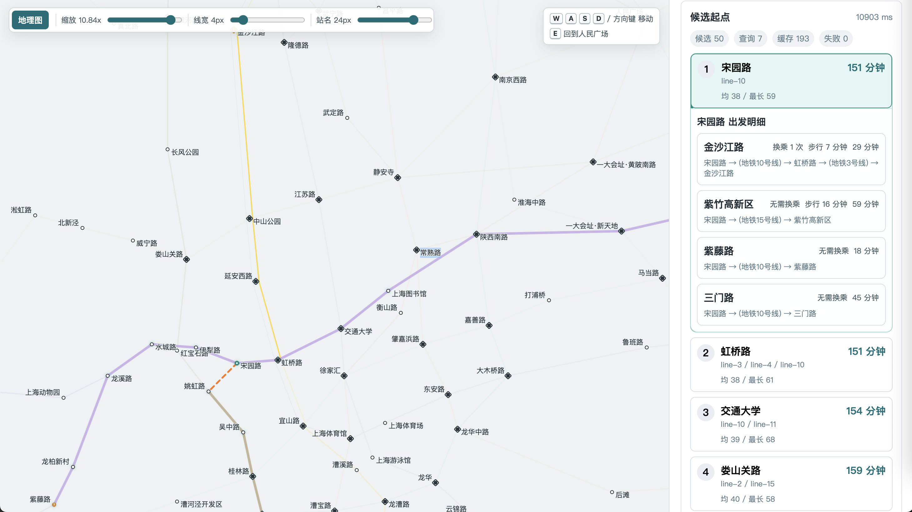

# MetroMeet 上海

MetroMeet 是一个本地优先运行的上海地铁多目的地通勤优化工具。它用于回答这类问题：给定多个目标地铁站，哪个地铁站作为出发点时，总通勤时间最短？






## 功能

- 交互式上海地铁图，支持站点搜索、目标站选择、平移、缩放和键盘移动。
- 根据总耗时、平均耗时、最短耗时、最长耗时对候选出发站排序。
- 通过高德 MCP 查询精确路线，支持本地缓存和自动重试。
- 使用本地地铁图做粗筛，减少 MCP 请求量。
- 出发明细展示每条路线的耗时、换乘次数、路线文本，并支持地图高亮。
- 支持从 OpenStreetMap Overpass 更新地铁数据；网络失败时可回退使用本地数据重新生成。

## 技术栈

前端：React 19、Vite、Zustand、TypeScript

后端：Fastify、TypeScript、MCP SDK

核心算法：本地地铁图、Dijkstra 风格估算、候选站排序

包管理：pnpm workspace

## 环境要求

- Node.js `>=26 <27`
- pnpm `>=11 <12`
- 高德 MCP Key

## 启动

安装依赖：

```bash
pnpm install
```

创建环境变量文件：

```bash
cp .env.example .env
```

编辑 `.env`：

```bash
AMAP_MCP_KEY=your-amap-mcp-key
API_PORT=4000
WEB_PORT=5173
```

获取高德服务key参考https://lbs.amap.com/api/mcp-server/create-project-and-key

启动程序：

```bash
pnpm dev
```

默认地址：

- 前端：`http://127.0.0.1:5173`
- 后端：`http://127.0.0.1:4000`

## 常用命令

```bash
pnpm dev                       # 同时启动 API 和前端
pnpm dev:api                   # 只启动 API
pnpm dev:web                   # 只启动前端
pnpm typecheck                 # 构建并检查类型
pnpm test                      # 运行测试
pnpm import:metro              # 更新/重新生成地铁数据
pnpm write:schematic-overrides # 重新生成示意图覆盖模板
```

## 地图数据更新

上海地铁数据位于 `data/shanghai-metro.json`。

更新或重新生成：

```bash
pnpm import:metro
```

脚本会优先从 OpenStreetMap Overpass 拉取最新数据。如果 Overpass 不可用，会回退到本地已有的 `data/shanghai-metro.json` 并重新生成布局和拓扑派生字段。

如存在 `data/schematic-overrides.json`，会应用示意图坐标覆盖。

更新后建议运行：

```bash
pnpm typecheck
pnpm test
```

## 高德 MCP

后端通过高德 MCP 查询精确路线：

使用 `maps_geo` 解析站点坐标。

使用 `maps_direction_transit_integrated` 查询公交/地铁路线。

MCP 请求带有限流、缓存和最多三次自动重试。成功路线会写入 `data/route-cache.json`。

获取高德服务key参考https://lbs.amap.com/api/mcp-server/create-project-and-key

## 项目结构

```text
apps/
  api/        Fastify API、高德 MCP 集成、路线缓存
  web/        React 前端
packages/
  core/       地铁图估算和排序逻辑
  shared/     共享 Zod schema 和 TypeScript 类型
scripts/
  import-shanghai-metro-osm.mjs
  validate-metro-data.mjs
  write-schematic-overrides-template.mjs
data/
  shanghai-metro.json
  schematic-overrides.json
  route-cache.template.json
```
